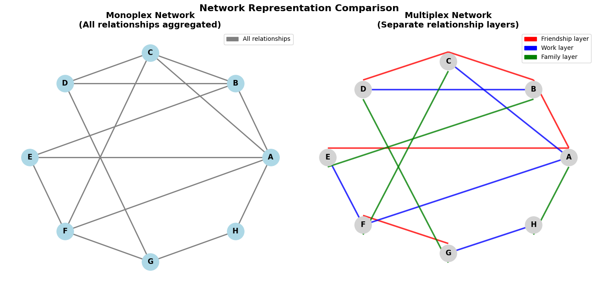
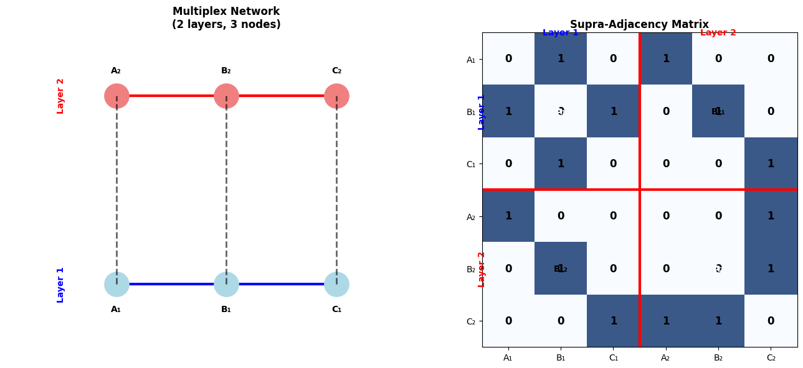
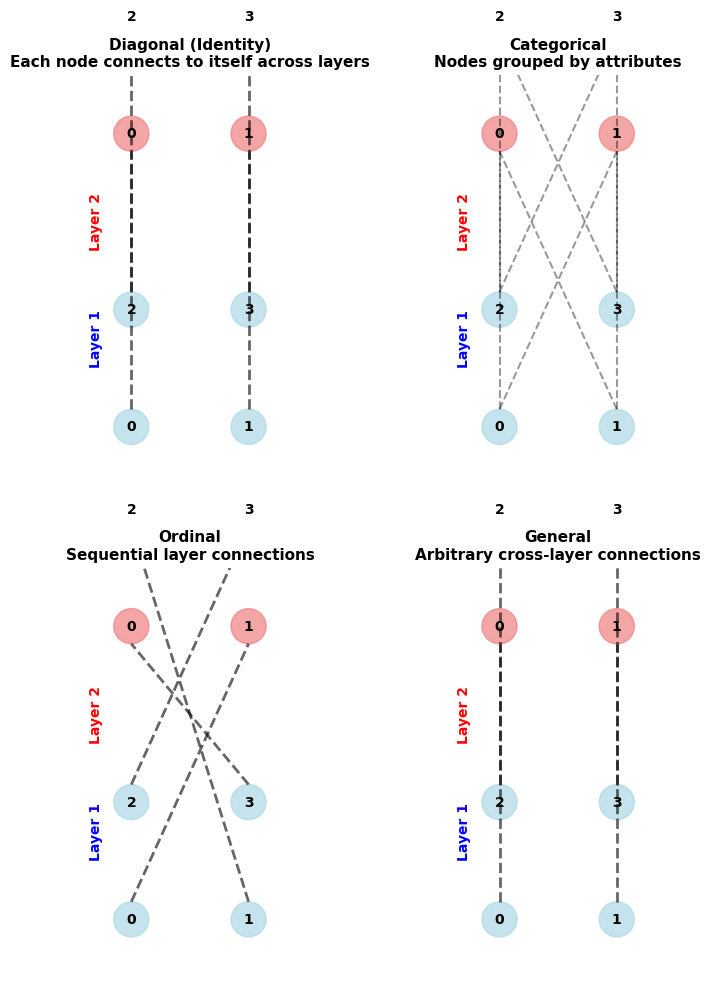
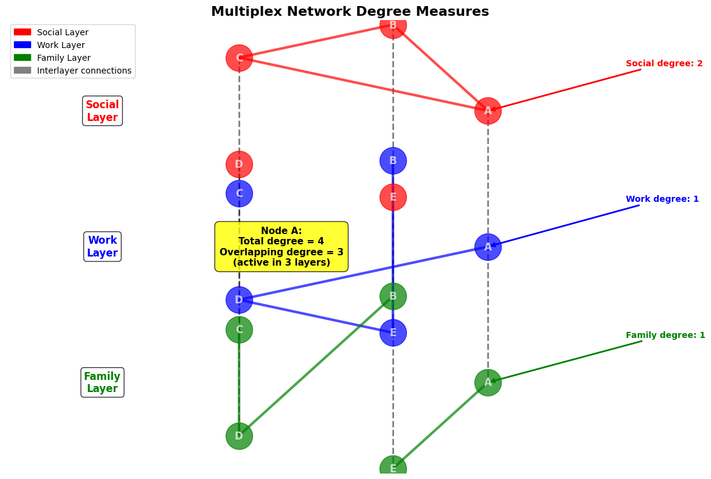

# Multi-layer Networks
## Understanding Complex Real-World Systems

Network Analysis - Lecture 11 Annex
Nikola Balic, Faculty of Natural Science, University of Split
Data Science and Engineering Master Program

---

## Learning Objectives

**By the end of this lecture, you will understand:**

- **What are** multi-layer networks and why we need them
- **How to represent** systems with multiple types of relationships
- **Key concepts** for analyzing multi-layer structures
- **Practical applications** in real-world domains
- **Basic tools** for multi-layer network analysis
- **When to use** multi-layer vs. single-layer approaches

---

## Why Multi-layer Networks?

**Real-world systems are inherently multi-layered:**

| **System** | **Multiple Layers** |
|-----------|-------------------|
| **Social Networks** | Facebook, Twitter, LinkedIn - different interaction types |
| **Transportation** | Air, rail, road - interconnected but distinct networks |
| **Biology** | Proteins, genes, metabolism - different biological processes |
| **Brain Networks** | Structure, function, causality - different connectivity types |
| **Infrastructure** | Power, communication, water - interdependent systems |

**Single-layer analysis misses crucial interdependencies!**

---

## The Problem with Traditional Networks

**What we usually do (Monoplex approach):**
- Combine all relationship types into one network
- Lose important context about *how* people are connected
- Miss patterns that exist only in specific relationship types

**What we should do (Multiplex approach):**
- Keep different relationship types separate
- Analyze how layers interact with each other
- Discover insights hidden in layer-specific patterns

---



---

## Key Terminology - Made Simple

**Multi-layer Network:** Any network with multiple types of connections
**Multiplex Network:** Same people/nodes in all layers (most common)
**Layer:** One specific type of relationship or connection
**Interlayer Connection:** How the same person/node relates across layers
**Node Activity:** How many layers a person/node participates in

**Think of it like social media:** Same person on Facebook, Twitter, LinkedIn - different behaviors, same individual.

---

## How to Represent Multi-layer Networks

**Basic building blocks:**
- **Nodes:** The same entities (people, airports, proteins) across layers
- **Intralayer edges:** Connections within each layer
- **Interlayer edges:** How nodes connect across layers

**Mathematical representation (simplified):**
- Each layer has its own adjacency matrix
- Stack them together to create a "super-matrix"
- Add connections between layers

---



---

## Types of Interlayer Connections

**Different ways to connect layers:**



**Most common:** Identity coupling - same person connects to themselves across layers

---

## Measuring Nodes in Multi-layer Networks

**New ways to count connections:**

**Within-layer degree:** How many connections in each specific layer
**Total degree:** Sum of connections across all layers
**Overlapping degree:** How many layers is this node active in?



---

## Key Insight: Node Versatility

**Versatile nodes:**
- Active in many layers
- Bridge different types of relationships
- Often the most influential in the system

**Specialized nodes:**
- Focus on one or few layers
- Experts in specific relationship types
- Important for layer-specific functions

**Example:** A person active on LinkedIn, Twitter, and Facebook vs. someone only on LinkedIn

---

## Community Detection in Multi-layer Networks

**New challenges:**
- Communities may exist only in some layers
- Some communities span multiple layers
- Need to balance layer-specific vs. global structure

**Approaches:**
1. **Layer-by-layer:** Find communities in each layer separately
2. **Global:** Find communities across all layers simultaneously
3. **Consensus:** Combine results from individual layers

---

## Spreading Processes - Why Layers Matter

**Information/Disease spreading in multi-layer networks:**

**Key differences from single networks:**
- **Multiple pathways:** Can spread via different relationship types
- **Layer-specific rates:** Spreads faster/slower in different layers
- **Cross-layer amplification:** Activity in one layer boosts others
- **Targeted interventions:** Block specific layers, not just nodes

**Example:** Misinformation spreads differently on Twitter vs. Facebook vs. WhatsApp

---

## Robustness: When Networks Break

**Multi-layer networks can be more robust:**
- **Redundancy:** If one layer fails, others can compensate
- **Diversification:** Different layers have different vulnerabilities

**But also more fragile:**
- **Cascade failures:** Failure in one layer triggers failures in others
- **Interdependency:** Layers depend on each other to function

**Real example:** 2003 Italian blackout - power grid failure cascaded through communication networks

---

## Real-World Applications

**Transportation Networks:**
- Different airlines as layers
- Route planning across multiple carriers
- Understanding resilience to disruptions

**Social Media Analysis:**
- User behavior across platforms
- Information spread patterns
- Influence measurement

**Biological Systems:**
- Gene regulation layers

---

## When to Use Multi-layer Analysis

**Use multi-layer when:**
- You have different types of relationships
- Relationship context matters for your research question
- You suspect layer interactions are important
- Single-layer analysis gives incomplete picture

**Stick with single-layer when:**
- All relationships are essentially the same type
- You need simple, fast analysis
- Layers don't interact meaningfully
- Data quality is poor across layers

---

## Step-by-Step Analysis Workflow

**1. Data Preparation:**
- Identify distinct relationship types
- Clean and align data across layers

**2. Network Construction:**
- Build separate networks for each layer
- Define interlayer connections

**3. Descriptive Analysis:**
- Compare basic statistics across layers
- Identify most versatile/specialized nodes
- Examine layer correlations

---

## Analysis Workflow (Continued)

**4. Advanced Analysis:**
- Community detection
- Centrality analysis

**5. Interpretation:**
- What do layer differences mean?
- Which nodes/edges are most important?
- How do results compare to single-layer analysis?

**6. Validation:**
- Cross-validation across layers
- Robustness checks and domain expert validation

---

## Practical Tools and Software

**Python packages:**
```python
# Basic approach
import networkx as nx
import numpy as np

# Specialized tools
import pymnet      # Multiplex networks
import multinet    # R package (via rpy2)
import igraph      # Has multilayer support
```

---

## Practical Tools and Software (Continued)

**R packages:**
- `multinet` - comprehensive multilayer analysis
- `muxViz` - visualization platform

**Visualization:**
- Gephi with multiplex plugins
- Custom D3.js implementations
- muxViz platform

---

## Common Pitfalls and How to Avoid Them

**Pitfall 1:** Too many layers
- **Solution:** Start simple, combine similar relationship types

**Pitfall 2:** Ignoring data quality differences across layers
- **Solution:** Validate each layer separately first

**Pitfall 3:** Over-interpreting small differences
- **Solution:** Use statistical tests and null models

**Pitfall 4:** Not validating interlayer connections
- **Solution:** Check if assumed connections actually exist

---

## Case Study: European Airport Network

**Research question:** How do different airlines create redundancy in air transportation?

**Approach:**
- Each airline = one layer
- Airports = nodes (same across layers)
- Flights = edges within layers

**Key findings:**
- Hub airports dominate multiple layers
- Low-cost carriers provide redundancy for popular routes
- Network resilience depends on airline diversity
- Failures cascade through airline partnerships

---

## Case Study: Social Media Analysis

**Research question:** How does information spread across platforms?

**Setup:**
- Twitter, Facebook, Instagram = separate layers
- Users = nodes (when active on multiple platforms)
- Cross-platform users = bridge nodes

**Insights:**
- Information moves faster on Twitter
- Facebook provides broader reach
- Cross-platform users act as amplifiers
- Platform-specific content performs differently

---

## Hands-on Exercise Preview

**Next session practical work:**

1. **Load real multiplex data** (European airports or social networks)
2. **Explore layer properties** - compare degree distributions
3. **Identify versatile nodes** - who connects across many layers?
4. **Community detection** - find groups in each layer
5. **Simulate spreading** - how does information/disease spread?
6. **Robustness testing** - what happens when layers fail?

**Goal:** Understand when multiplex analysis adds value over single-layer

---

## Best Practices Summary

**Design principles:**
1. **Clear motivation** - why do you need multiple layers?
2. **Meaningful layers** - each layer should represent distinct processes
3. **Start simple** - begin with 2-3 layers, add complexity gradually
4. **Validate assumptions** - check if interlayer connections make sense

**Analysis strategy:**
1. **Explore each layer individually** first
2. **Compare layers** systematically
3. **Focus on differences** that matter for your research question
4. **Interpret results** in domain context

---

## Key Takeaways

**Multi-layer networks help us:**
- **Preserve context** in complex systems
- **Discover hidden patterns** missed by single-layer analysis
- **Design better interventions** by targeting specific layers
- **Understand resilience** through layer interdependencies

**Remember:**
- Not every system needs multi-layer analysis
- Start with clear research questions
- Validate your approach with domain experts
- Interpretation is as important as analysis

---

## Looking Forward

**Emerging trends:**
- **Temporal multilayer networks** - layers changing over time
- **Machine learning** on multiplex data
- **Higher-order interactions** - beyond pairwise connections
- **Dynamic processes** - how layers evolve and interact

**Your research:**
- What systems could benefit from multiplex analysis?
- How would you define layers in your domain?
- What new insights might you discover?
